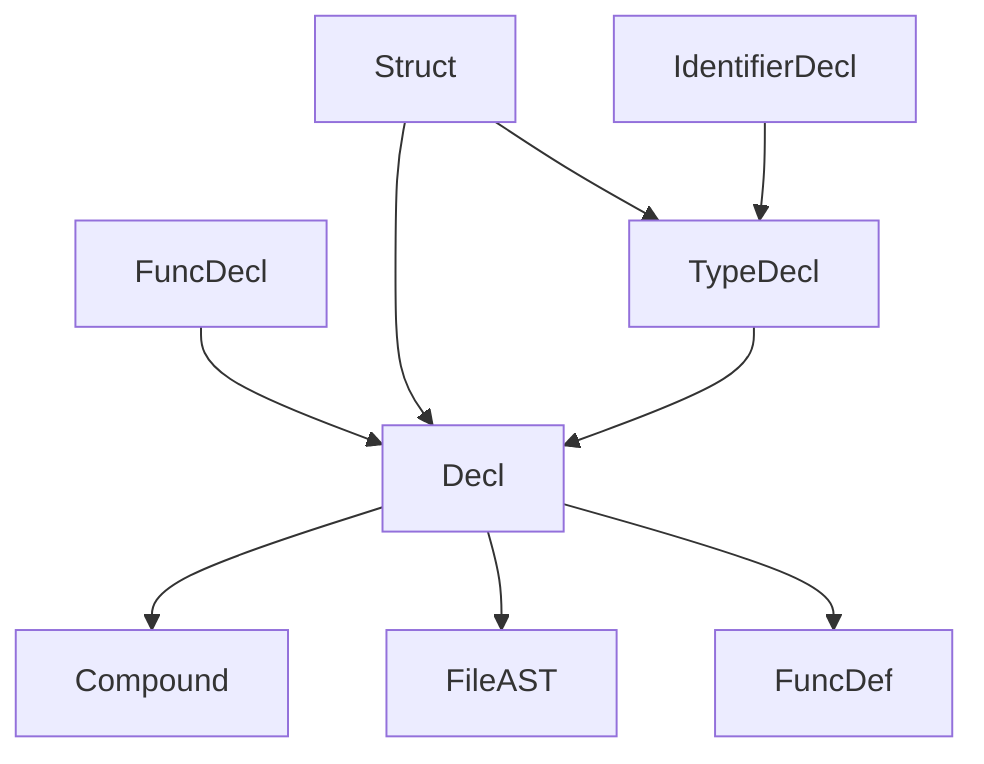

# 说明

本文档列出了c_ast.py中定义的各个节点类(Node类的子类).

在每个类的部分,我们给出一个多级列表.格式如下:

- 成员变量1

  - 该变量可能的类型1
  - 该变量可能的类型2

- 成员变量2

  ...

# 变量声明



## Decl

Decl的两个成员以及它们可能的类型(未必全面):

- type
  - TypeDecl 变量的声明走这条线
  - ArrayDecl
  - PtrDecl
  - FuncDecl
  - Struct 结构体的定义走这条线
- init
  - Constant
  - InitList 例如数组的初始化列表
  - BinaryOp 表达式例如a+b
  - UnaryOp 表达式例如&a
  - None 无初始化

## Struct

- name 结构体的名字
- decls 是一个Decl列表,即结构体中声明的变量

## TypeDecl

- type
  - IdentifierType 不是以struct开头的类型
  - Struct 以struct开头的类型,此处Struct.decls=None

## IdentifierType

- names 一个list存了类型的全名例如['unsigned','int']

## Typedef

- name 定义后的类型名
- storage=['typedef'] (还不清楚什么意思)
- type
  - TypeDecl


## PtrDecl

- type
  - TypeDecl
    - type=IdentifierType

# 函数定义

## FuncDef

全局变量的声明(Decl)和函数定义(FuncDef)在ast上是同层的.

FuncDef包含成员:

- decl
  - Decl
    - type=FuncDecl
- param_decls (这个还不知道是干嘛的,目前来看这个都是None)
- body 函数体
  - Compound


## FuncDecl

- args
  - ParamList
- type 返回值类型
  - TypeDecl
- body
  - Compound


## ParamList

- params Decl数组

## Compound

函数体就是一个Compound.

- block_items 一个数组,里面可以是任意的类型

# 结构体

```c
struct Point{
    int x,y;
};
```

上述代码语法树展开为:

- Decl
  - name=None
  - type=Struct
    - Struct的完整信息

```c
struct Point{
    int x,y;
} a,b;
```

上述代码语法树展开为:

- Decl
  - name=a
  - type=TypeDecl
    - type=Struct
      - Struct的完整信息
- Decl
  - name=b
  - type=TypeDecl
    - type=Struct
      - Struct的完整信息

## StructRef

`a.x`中a是name,x是field

- name
  - ID
- type
  - '.'
- field
  - ID

# 控制语句

## If

- cond
  - BinaryOp
- iftrue
  - Compound
- iffalse
  - None

# 表达式

## ID

name

## UnaryOp

- op
  - str
- expr
  - ID

